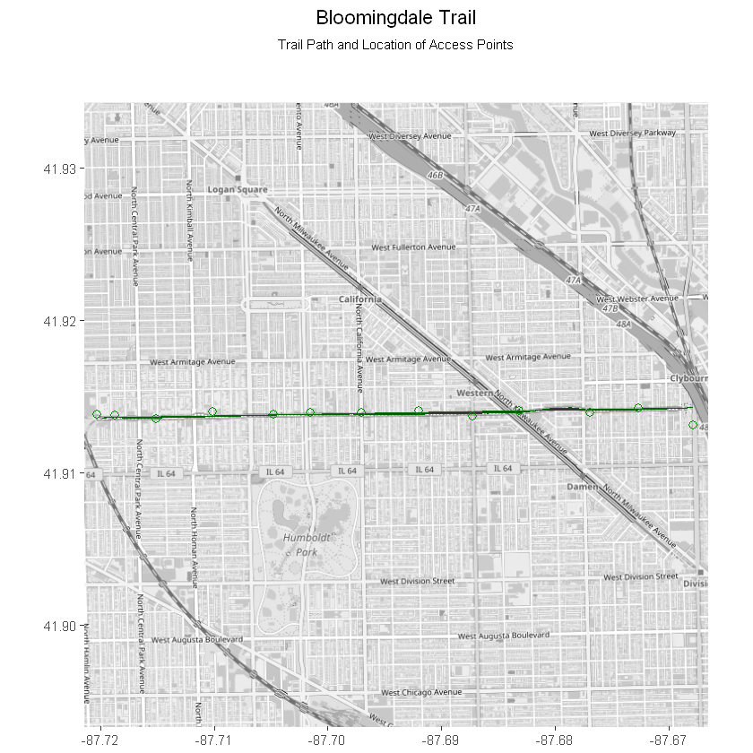
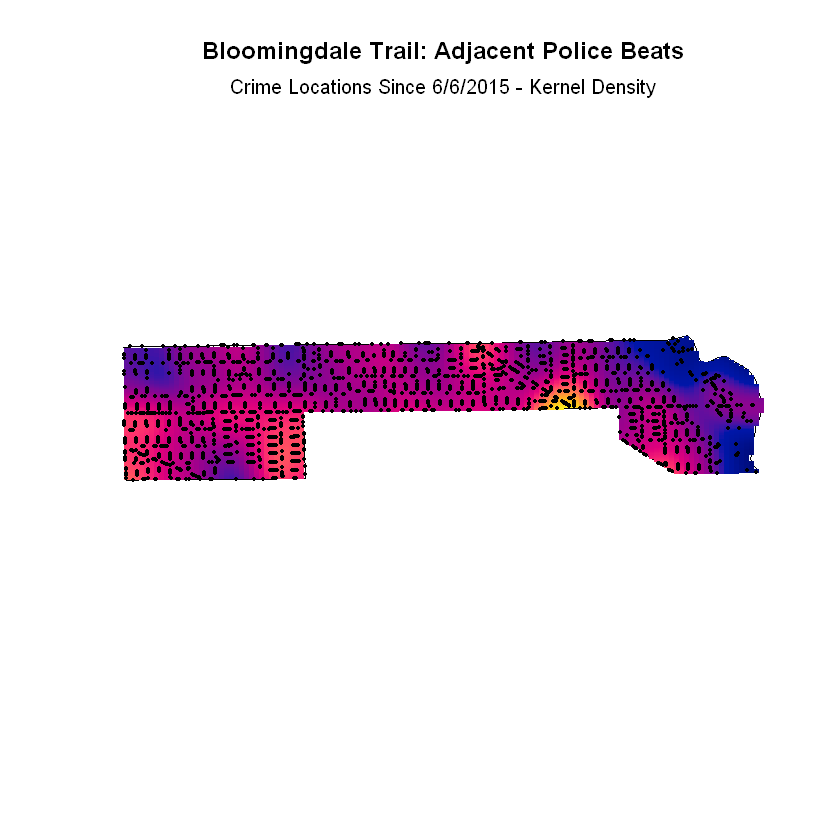
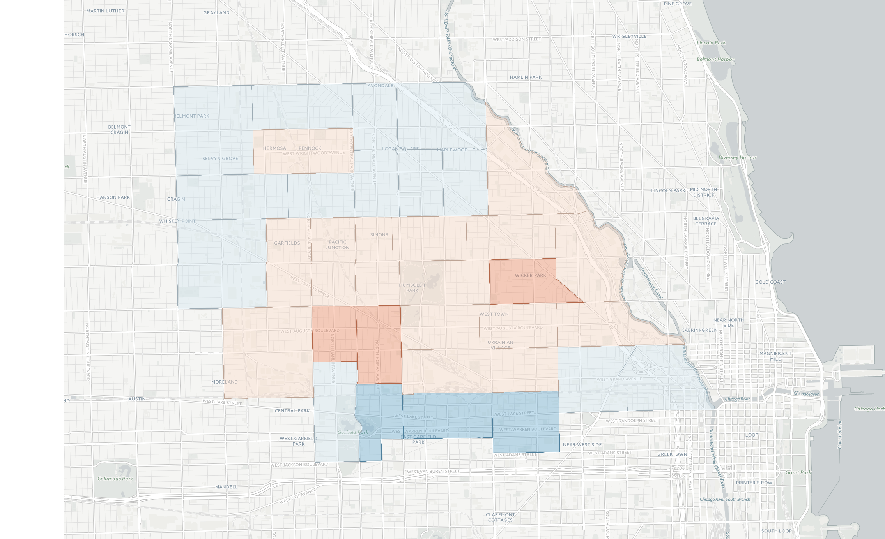

# 606 & Crime Rates

### What impact has the construction of the Bloomingdale Line Trail and Park had on patterns of criminal activity in the surrounding community?

The Bloomingdale Trail and Park, known colloquially as The 606, is a 2.7-mile long, multiuse rails-to-trail project located in Chicago’s Northwest Side. Opened in June 2015, The 606 connects four neighborhoods, with 13 distinct access points; this increased mobility and promise of economic development brought by the project has prompted critics to claim the trail is responsible for elevated crime in the area.

To evaluate the trail’s overall effect on crime, I used data from the City of Chicago Data Portal, which included information on police incidents including coordinate location, relevant police beat area, arrest outcome, and primary crime type. To this, I added features for the Euclidean distance, as well as the cardinal direction, of each observation, relative to the trail. As I was primarliy concerned with local effects, I chose to examine only crimes in beats contingent to the trail.

### Methodology
Using measures of point-pattern, aggregated, and temporal analysis, I tested for spatial randomness in the data. First, I calculated and plotted crime intensity around the trail since its opening. The results suggest evidence of clustering, but not in a systemic way that would indicate a spatial influence of The 606.

Next, I turned to aggregating analysis, grouping crimes by police beat area and month for the 16 months pre- and post-trail completion. This approach seemed reasonable, as police beats represent the smallest, most relevant areal unit for which data was availible, and grouping by month helped control for seasonality effects while allowing for easier time-unit comparison.

As a first, hedonic exercise, I compared crime patterns and intensisty across police beats near and adjacent to the trail during the same time period. No obvious clustering was evident around the location of the trail, although an east-west intensity split seemed possible. Testing for measures of local autocorrelation showed two significant clusters - one of high values and one of a high value outlier - suggesting that, either, if the trail had any effect on crime, it would not be applied uniformly across its run, or that the effect of the trail is overwhelmed by simultaneous, competing influences. 

Finally, I attempted a pseudo difference-in-differences calculation, defining as treatment the opening of the trail. Using data from 2014, 2015, and 2016, an OLS regression revealed no statistically significant difference between crime in police beats adjacent to or near the trail.

Ultimately, I was unable to find immediate evidence of negative, criminal externalities to the opening of The 606. However, these results should be interpreted as primarily; opportunities for further research on the topic certainly exist. I would like to more rigorously test the dynamic component of this analysis, incorporating more time periods, and a more granular scope to time.

*This repository represents part of a final project for Fall 2016 Introduction to Spatial Data Science.*
